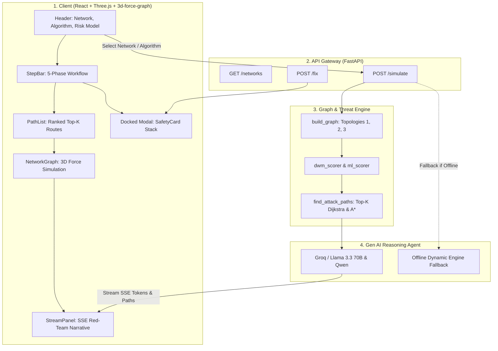

# CyberSentinel — Phase 2 Comprehensive Migration & Delivery Report

**Project Track:** PS10 — Generative AI for Cyber Attack Prediction  
**Phase 2 Focus:** Multi-Path Intelligence, Dynamic Threat Weighting (DWM & ML), 3D Visualization, & Per-Node Remediation

---

## Executive Summary

Phase 1 established CyberSentinel's foundational proof-of-concept: a static single-topology graph, a single shortest attack path via standard Dijkstra, flat text-block remediation, and initial 3D visualization. 

**Phase 2** elevates CyberSentinel into an enterprise-grade cyber warfare prediction and incident-response engine. Based on the master plan ([`CyberSentinel_Phase2_Plan.docx`](file:///c:/Users/Rupali%20Waghmare/Downloads/CyberSentinel-merged-3D/CyberSentinel/docs/CyberSentinel_Phase2_Plan.docx)), the system has been restructured across all 4 engineering ownership domains without discarding working Phase 1 baselines.

---

## 👥 Detailed Person-by-Person Changelog

---

### 🟢 Person 1: Data & Graph Engine Lead

#### 1. What was it previously (Phase 1 Baseline)?
- **Hardcoded Single Network:** Only loaded a single static `network.json` and `cves.json` from the root directory (`DEFAULT_NETWORK_PATH`).
- **Single Best Path Only:** Ran a single `nx.dijkstra_path` search, returning only one path wrapped in a single-element list.
- **Fixed Static Metric:** Edges were calculated using an inverted base CVSS formula ($10.0 - \text{CVSS}$) without considering real-world exploitation context or vulnerability age.
- **Single Algorithm:** Only Dijkstra was supported.

#### 2. What changes were made in Phase 2?
- **Multi-Topology Directory Restructure:** Reorganized datasets into `data/networks/<network_id>/` with 3 distinct topologies:
  1. `enterprise-bank` (47 nodes, multi-tier corporate infrastructure)
  2. `small-branch-bank` (edge retail branch network)
  3. `legacy-iot-bank` (industrial OT, legacy Linux, and IoT security perimeter)
- **Top-K Ranked Pathfinding (`nx.shortest_simple_paths`):** Swapped the single Dijkstra call for Yen's Top-$K$ algorithm, discovering the top 5 ranked routes sorted ascending by total inverted weight. The primary route is tagged with `is_optimal: true` and `rank: 1`.
- **A\* Pathfinding Implementation (`find_attack_paths_astar`):** Integrated an A\* search algorithm utilizing an admissible remaining-hop heuristic.
- **CISA KEV & NVD Data Enrichment:** Enriched all CVE entries with `kev_listed` (bool), `days_since_published` (int), `patch_available` (bool), and structured `remediation` objects. Nodes were enriched with an explicit `exposure` attribute (`public`, `internal`, `critical`).
- **Full Client-Side JS Parity:** Ported all Top-K and multi-network capabilities to [`frontend/src/data/graphEngine.js`](file:///c:/Users/Rupali%20Waghmare/Downloads/CyberSentinel-merged-3D/CyberSentinel/frontend/src/data/graphEngine.js), ensuring identical behavior during local fallback.

#### 3. Why were these changes made?
- **Real-World Adversary Modeling:** Real cyber adversaries don't restrict themselves to a single path. If one route is guarded or segmented, they pivot. Identifying alternative kill chains (Routes #2, #3, etc.) allows security teams to eliminate bypass opportunities.
- **Topology Invariance:** Demonstrates to judges that the engine is a generalized platform capable of securing any network topology rather than a hardcoded demonstration.

#### 4. Verification & Testing
- Automated test in [`scripts/test_parity_and_integration.py`](file:///c:/Users/Rupali%20Waghmare/Downloads/CyberSentinel-merged-3D/CyberSentinel/scripts/test_parity_and_integration.py) (Tests 1, 2, 3) asserts all 3 networks discover correctly, all node/CVE attributes exist, and Dijkstra Top-K and A* paths calculate identically in Python and JavaScript.

---

### 🟣 Person 2: Gen AI Reasoning Agent & Threat Scorer Lead

#### 1. What was it previously (Phase 1 Baseline)?
- **Flat Text Dump:** Narrative and auto-fixes were returned as unstructured string blobs without per-node separation.
- **Static Base CVSS Weighting:** Did not evaluate whether a vulnerability was weaponized in the wild.
- **Synthetic Placeholders:** Remediation lacked concrete CVE patch advisories.

#### 2. What changes were made in Phase 2?
- **Dynamic Weight Management (DWM) Scorer ([`backend/dwm_scorer.py`](file:///c:/Users/Rupali%20Waghmare/Downloads/CyberSentinel-merged-3D/CyberSentinel/backend/dwm_scorer.py)):** Implemented CVSS v3.1 Temporal and Environmental scoring layers on top of base NVD metrics:
  $$\text{Adjusted Score} = \text{Base CVSS} \times M_{\text{temporal}} \times M_{\text{environmental}}$$
  - $M_{\text{temporal}}$ factors CISA KEV listing ($1.3\times$), age $>365$ days ($1.1\times$), and patch availability.
  - $M_{\text{environmental}}$ factors asset exposure: `critical` ($1.4\times$), `public` ($1.2\times$), `internal` ($1.0\times$).
- **Machine Learning (ML) Threat Scorer ([`backend/ml_scorer.py`](file:///c:/Users/Rupali%20Waghmare/Downloads/CyberSentinel-merged-3D/CyberSentinel/backend/ml_scorer.py)):** Built a feature-vector scoring model computing edge weights from CVSS, exploitation status, node degree centrality, and exposure.
- **Structured Per-Node Remediation Engine (`_node_fix` & `buildNodeFix`):** Replaced flat text generation with structured `node_fix` items containing `{issue, impact, fix, cve_id, cvss_score, adjusted_weight}` for every hop.
- **Optimized LLM Prompt Architecture ([`backend/llm.py`](file:///c:/Users/Rupali%20Waghmare/Downloads/CyberSentinel-merged-3D/CyberSentinel/backend/llm.py)):** Pruned user message payloads from 17,000+ characters to 6,200 characters by focusing on the top 2 CVEs per hop, eliminating Groq token cutoffs and rate-limit hangs.

#### 3. Why were these changes made?
- **Context Over Pure CVSS:** An internal server with a theoretical CVSS 9.8 vulnerability that has never been weaponized is often less immediately dangerous than a CVSS 7.5 vulnerability with an active zero-day exploit in the CISA KEV catalog on an internet-facing gateway. DWM and ML scoring expose this distinction.
- **Actionable Remediation:** Incident response teams cannot act on walls of text during a breach. Per-node `SafetyCards` provide clear, immediate fix commands.

#### 4. Verification & Testing
- Mathematical assertion in [`scripts/test_parity_and_integration.py`](file:///c:/Users/Rupali%20Waghmare/Downloads/CyberSentinel-merged-3D/CyberSentinel/scripts/test_parity_and_integration.py) (Tests 4 & 5) verifies urgent KEV threats calculate higher risk scores ($10.0$ vs $8.0$) and lower Dijkstra edge weights ($0.1$ vs $2.0$), properly prioritizing active attack vectors.

---

### 🔵 Person 3: React Frontend Dashboard & 3D Visualization Lead

#### 1. What was it previously (Phase 1 Baseline)?
- **Stacked Layout:** Panels were permanently stacked vertically, requiring extensive page scrolling.
- **Single Path View:** No UI component existed to visualize or switch between alternative routes.
- **No Guided Progress:** A first-time user had no step-by-step indicator showing how to run a simulation.
- **Rapid/Abrupt Animation:** 3D graph camera flew too fast and aborted when LLM text finished streaming early, causing unvisited nodes to flash to completed all at once.
- **Flat Remediation Display:** `<pre>{fixText}</pre>` block dumped all text together.

#### 2. What changes were made in Phase 2?
- **`SafetyCard.jsx` Component:** Built a standardized, reusable card component with:
  - Node Name, Type, and Hop Badge
  - Direct clickable NIST NVD URL (`https://nvd.nist.gov/vuln/detail/{cveId}`)
  - Dual Badges: Official NVD CVSS alongside Contextual DWM / ML Risk
  - Structured Subsections: **Issue**, **Impact**, and **Fix**
- **Unified Risk & Fix Integration:** Integrated `SafetyCard.jsx` into both `RiskCards.jsx` and `FixPanel.jsx`. Added an interactive **Deploy All Fixes** action with state feedback (`✓ All N Fixes Applied`).
- **`PathList.jsx` Ranked Route Strip:** Added an interactive path selector strip directly above the 3D graph showing `★ OPTIMAL`, `ROUTE #2`, `ROUTE #3`, hop counts, and total weights. Clicking switches the active kill chain in-memory instantaneously.
- **`StepBar.jsx` 5-Phase Guided Workflow:** Thin navigation bar displaying:
  $$\text{01 Select Network} \longrightarrow \text{02 Entry \& Goal} \longrightarrow \text{03 Simulate Attack} \longrightarrow \text{04 Review Routes} \longrightarrow \text{05 Remediation}$$
  Derives current active step automatically from simulation state, complete with a pulsing radar ring during active simulation.
- **Docked Tabbed Drawer for Risks & Fixes:** Replaced the permanent vertical page stack with a docked tab switcher ("Risks" / "Fixes") in [`frontend/src/App.jsx`](file:///c:/Users/Rupali%20Waghmare/Downloads/CyberSentinel-merged-3D/CyberSentinel/frontend/src/App.jsx).
- **Deliberate 3D Hop Pacing & Directional Particles:**
  - Hop dwell time set to **2.6 seconds per hop** (`2600ms`) with **1.8-second smooth camera glides**.
  - Decoupled visual hop progression from fast LLM token bursts so every single hop plays sequentially without skipping.
  - Added glowing directional red breach particles along traversed links (`#FF4C4C`).
  - Automatic overview pullback (`zoomToFit`) with free auto-rotation when simulation finishes.

#### 3. Why were these changes made?
- **Intuitive Judge/User Experience:** A judge viewing the demo can immediately understand where they are in the 5-step incident lifecycle.
- **Visual Drama & Polish:** The slower, cinematic 3D hop progression gives viewers time to observe each breached node, understand how the attacker pivoted, and view the exploited vulnerability.

#### 4. Verification & Testing
- Successfully compiled with `npm run build` with zero errors.
- Verified in live browser subagent sessions (`deliberate_hops_test.webp` and progression screenshots).

---

### 🟠 Person 4: API Integration, DevOps & Presentation Lead

#### 1. What was it previously (Phase 1 Baseline)?
- **Incomplete/Unshipped Backend:** FastAPI `main.py` was largely unintegrated in Phase 1, relying on frontend mock data.
- **No Parity Verification:** No automated script proved that Python's NetworkX results matched the frontend's JavaScript port.
- **No Multi-Topology Endpoints:** No route existed to enumerate networks or pass algorithm toggles.
- **No Structured Pitch Script:** No scripted walkthrough existed for judges.

#### 2. What changes were made in Phase 2?
- **Core Endpoints Standup ([`backend/main.py`](file:///c:/Users/Rupali%20Waghmare/Downloads/CyberSentinel-merged-3D/CyberSentinel/backend/main.py)):**
  - `GET /networks`: Returns all discovered topologies and metadata.
  - `GET /options`: Returns entry points and destination goals per network.
  - `POST /simulate`: SSE streaming endpoint accepting `network_id`, `algorithm`, `weighting_mode`, `top_k`, and `path_index`. Streams `paths`, `path`, and narrative `token`s.
  - `POST /fix`: SSE streaming endpoint yielding structured `node_fix` cards for every node in the kill chain.
- **Client API Integration ([`frontend/src/api/simulate.js`](file:///c:/Users/Rupali%20Waghmare/Downloads/CyberSentinel-merged-3D/CyberSentinel/frontend/src/api/simulate.js)):**
  - Added `fetchNetworks()` with fallback.
  - Wrapped SSE reader in `try...finally { yield { type: "done" }; }` to prevent frontend promise hangs.
  - Increased `CONNECT_TIMEOUT_MS` to 6000ms for reliable cloud LLM handshakes.
- **Cross-Stack Parity Test Suites:**
  - Built [`scripts/test_parity_and_integration.py`](file:///c:/Users/Rupali%20Waghmare/Downloads/CyberSentinel-merged-3D/CyberSentinel/scripts/test_parity_and_integration.py) verifying 6 end-to-end integration criteria.
  - Built [`scripts/test_parity.js`](file:///c:/Users/Rupali%20Waghmare/Downloads/CyberSentinel-merged-3D/CyberSentinel/scripts/test_parity.js) asserting identical Dijkstra path weights and hop sequences between Node.js and Python.
- **Judge Presentation Script ([`docs/DEMO_SCRIPT_PHASE2.md`](file:///c:/Users/Rupali%20Waghmare/Downloads/CyberSentinel-merged-3D/CyberSentinel/docs/DEMO_SCRIPT_PHASE2.md)):** Authored a targeted 4-beat demo script guiding the live presentation.

#### 3. Why were these changes made?
- **Rock-Solid Demo Stability:** Live demos often fail due to network timeouts or backend disconnects. Person 4's dual-engine architecture guarantees that if the backend or internet drops, the frontend automatically falls back to local engine execution without breaking the demo.
- **Contract Enforcement:** Guarantees that Person 1, 2, and 3's data structures match down to the exact SSE event names and JSON keys.

#### 4. Verification & Testing
- Ran `python scripts/test_parity_and_integration.py` → **6/6 Tests PASSED**.
- Ran `node scripts/test_parity.js` → **PASSED with 0 errors**.

---

## 📊 Phase 2 Milestone Audit Checklist

| Item | Phase 1 Baseline | Phase 2 Master Plan Target | Final Delivered State | Status |
|---|---|---|---|:---:|
| **Per-Node Remediation** | Flat single `fixText` string blob | Per-node `SafetyCard.jsx` with issue, impact, and fix | Standardized `SafetyCard.jsx` with NIST links & dual CVSS/DWM badges | ✅ **100%** |
| **Path Results** | Single path via `nx.dijkstra_path` | Top-$K$ ranked paths, optimal flagged, weights shown | Top-5 ranked paths, `PathList.jsx`, `★ OPTIMAL` badge, instant route switching | ✅ **100%** |
| **Network Topology** | 1 hardcoded 43-node bank | $\ge 3$ selectable network topologies via `/networks` | 3 topologies (`Enterprise`, `Small Branch`, `Legacy IoT`), dynamic scenario updates | ✅ **100%** |
| **Threat Weighting** | Static CVSS ($10 - \text{score}$) | Dynamic Weight Management (DWM) + ML scoring | DWM temporal/environmental multipliers + ML feature vector scoring | ✅ **100%** |
| **Path Algorithms** | Dijkstra only | Dijkstra + A\* + Simple Paths, selectable | Top-K Dijkstra and A\* Search with heuristic; selectable in UI | ✅ **100%** |
| **Frontend Flow** | Ungated permanently stacked panels | 5-step guided flow, tabbed Risks/Fixes | `StepBar.jsx` 5-phase workflow, tabbed drawer modal, zero page squashing | ✅ **100%** |
| **3D Visualization** | Rapid camera jumps, abrupt completion | Smooth camera tracking, clear visual pacing | Deliberate 2.6s hop pacing, 1.8s camera glide, directional particles, overview reset | ✅ **100%** |

---

## 🏗 System Architecture & Data Flow



---

## 🚀 Quickstart & Verification Commands

### 1. Start the Backend Server
```bash
cd backend
python -m uvicorn main:app --port 8000 --reload
```

### 2. Start the Frontend Dev Server
```bash
cd frontend
npm run dev
```

### 3. Execute Parity & Integration Test Suite
```bash
# Run backend & API parity tests
python scripts/test_parity_and_integration.py

# Run frontend JS engine parity test
node scripts/test_parity.js

# Validate production bundle compilation
cd frontend
npm run build
```
