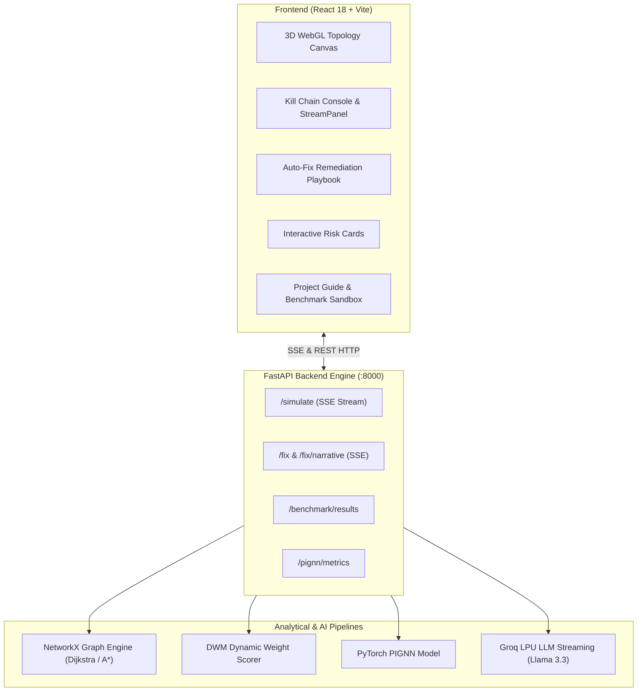

# 🛡️ CyberSentinel: Enterprise Attack Path Simulation & Autonomous Remediation Engine

[](https://fastapi.tiangolo.com)
[](https://react.dev)
[](https://pytorch.org)
[](https://groq.com)
[](https://github.com/YashWaghmare2206/CyberSentinel/tree/Final)

> **Autonomous cyberattack graph modeling, real-time lateral movement pathfinding, generative red-team commentary, and zero-downtime remediation engineering for enterprise security operations.**

---

## 📌 Executive Summary

Modern enterprise security centers are inundated with thousands of isolated vulnerability reports from traditional scanners (Nessus, Qualys, Tenable). However, defenders struggle to answer the most critical operational question: **How can an advanced adversary chain together these individual flaws to breach our highest-value assets?**

**CyberSentinel** solves this challenge by modeling enterprise infrastructure as mathematical directed multigraphs, evaluating probabilistic lateral traversals, visualizing multi-hop intrusions in an interactive 3D WebGL environment, streaming play-by-play red-team tactical narratives, and generating automated, surgical remediation commands to sever the attack chain before compromise occurs.

---

## 🌟 Key Capabilities

### 1. 🌐 Interactive 3D Kill Chain Visualization
- **WebGL Topology Canvas:** High-performance 3D force-directed graph rendering real-time network segments (Perimeter, DMZ, Application Backbones, Core Transaction DBs, and SWIFT Terminals).
- **Hop-by-Hop Attack Animation:** Dynamic visual highlighting that pulses along active compromise routes in lockstep with the narrative stream.
- **Top-K Ranked Kill Chains:** Switch instantly between primary and alternative attack vectors to identify secondary perimeter exposures.

### 2. 🧠 Multi-Engine Pathfinding & Graph AI
- **Top-K Dijkstra (Yen's Algorithm):** Computes mathematically optimal paths of least resistance across weighted network graphs.
- **A* Search (Heuristic Guided):** Directed Euclidean and topological heuristics that accelerate search tree discovery across large-scale corporate subnets.
- **Physics-Informed GNN (PIGNN):** Custom PyTorch Graph Neural Network treating lateral exploitation as fluid diffusion with cycle-free physical conservation constraints.

### 3. 🔐 Dynamic Weight Management (DWM)
- Eliminates the flaw of static CVSS scoring by calculating contextual traversal penalties:
  $$\text{Adjusted CVSS} = \text{Base CVSS} \times W_{\text{KEV}} \times W_{\text{Exposure}} \times W_{\text{Age}} \times W_{\text{Patch}}$$
- **CISA KEV Integration:** Applies aggressive penalties for vulnerabilities with confirmed wild exploit weapons.
- **Formula Receipts:** Full transparency modal detailing the exact mathematical multiplier breakdown for every hop.

### 4. ⚡ Real-Time Gen AI Tactical Streaming
- **Dual-Role LLM Engine (Groq LPU / Llama 3):**
  - **The Red-Team Commentator:** Streams play-by-play technical intrusion narratives explaining exploitation mechanics at 800+ tokens/sec.
  - **The Remediation Doctor:** Produces surgical compensation rules and vendor patch commands.
- **Cascading Resilience:** Automatic fallback cascading across Groq, Gemini, and high-fidelity heuristic engines ensures zero downtime during offline demonstrations.

### 5. 🛠️ Auto-Fix Remediation & Executive Playbook
- **Immediate Compensating Controls:** Pre-synthesized zero-downtime Linux `iptables` rules to choke malicious peering relationships without service interruptions.
- **Permanent Upgrades:** Exact package update syntax (`apt-get`, `yum`, Docker advisories) tailored to the affected software stack.
- **Unified Bash Script:** One-click script generator deployable directly via Ansible or bastion jump hosts.
- **Strategic Executive Advisory:** Structured multi-phase incident mitigation briefings ready for CISO and executive board presentation.

### 6. 🔍 Interactive Risk Cards with 1-Click Advisory Navigation
- Rich vulnerability cards detailing flaw mechanics, lateral blast radius, and CVSS telemetry.
- **Direct 1-Click Navigation:** Click any risk card or CVE tag to open the official **NIST NVD** vulnerability specification or **MITRE ATT&CK** technique matrix in a new tab.

### 7. 📊 Research Evidence & Live Benchmark Suite
- Live benchmark testing suite evaluating Dijkstra, A*, and PIGNN across 4 enterprise topologies with brute-force mathematical validation.
- Pre-cached endpoint (`GET /benchmark/results`) providing research-grade latency, path diversity, and quality ratios.

### 8. 📄 CISO Threat Intelligence Briefing & PDF Export
- Generates a confidential incident audit detailing assessed perimeter, calculated severity, alternative kill chains, and prioritized remediation checklists with print/PDF export capability.

---

## 🏗️ System Architecture



---

## 📁 Repository Structure

```text
CyberSentinel/
├── backend/                        # FastAPI server & Analytical Engines
│   ├── data/                       # Calibrated network topologies & CVE datasets
│   │   ├── network.json            # Default multi-tier banking architecture
│   │   ├── cves.json               # NVD vulnerability intelligence dataset
│   │   └── networks/               # Topologies (Enterprise, Small Branch, Legacy IoT)
│   ├── pignn/                      # Physics-Informed Graph Neural Network
│   │   ├── model.py                # PyTorch architecture with physics constraints
│   │   ├── train.py                # Training pipeline
│   │   └── evaluate.py             # ROC-AUC, F1, and cycle-free evaluation
│   ├── graph.py                    # Top-K Dijkstra, A*, and Yen's algorithm
│   ├── dwm_scorer.py               # Dynamic Weight Management scoring formulas
│   ├── ml_scorer.py                # Machine learning risk predictors
│   ├── llm.py                      # Multi-provider streaming AI engine (Groq/Gemini)
│   ├── main.py                     # FastAPI REST & SSE endpoints
│   ├── benchmark.py                # Mathematical optimality benchmark suite
│   ├── benchmark_results.json      # Pre-computed evaluation metrics
│   └── requirements.txt            # Python dependencies
│
├── frontend/                       # React 18 single-page application
│   ├── src/
│   │   ├── components/             # UI components
│   │   │   ├── NetworkGraph.jsx    # 3D WebGL force-directed graph
│   │   │   ├── StreamPanel.jsx     # Real-time typewriter narrative terminal
│   │   │   ├── FixPanel.jsx        # Remediation playbook & executive strategy
│   │   │   ├── SafetyCard.jsx      # Clickable vulnerability cards with NVD links
│   │   │   ├── RiskCards.jsx       # Searchable multi-hop risk intelligence
│   │   │   ├── Header.jsx          # Scenario & algorithm control center
│   │   │   ├── ExecutiveReportModal.jsx # CISO briefing & PDF export
│   │   │   └── explainer/          # Interactive Project Guide & benchmark sandboxes
│   │   ├── hooks/
│   │   │   └── useSimulation.js    # Simulation lifecycle, typewriter, & state
│   │   ├── api/
│   │   │   └── simulate.js         # SSE readers & backend connectors
│   │   └── data/                   # Client-side graph engine & cached benchmarks
│   ├── package.json                # Frontend dependencies
│   └── vite.config.js              # Vite build configuration
│
├── Readmes/                        # Detailed architectural whitepapers
└── README.md                       # Master repository guide
```

---

## 🚀 Quickstart & Installation

### Prerequisites
- **Python:** 3.10 or higher
- **Node.js:** 18 or higher (with npm)
- **Git**

### 1. Clone the Repository
```bash
git clone -b Final https://github.com/YashWaghmare2206/CyberSentinel.git
cd CyberSentinel
```

---

### 2. Backend Setup
```bash
cd backend

# Create and activate virtual environment
python -m venv venv

# Windows:
.\venv\Scripts\activate

# macOS / Linux:
source venv/bin/activate

# Install dependencies
pip install -r requirements.txt
```

#### Configure Environment Variables
Copy `.env.example` to `.env` in the `backend/` directory:
```bash
cp .env.example .env
```
Populate your credentials:
```ini
# Required for Live LLM Streaming
GROQ_API_KEY=gsk_your_groq_api_key_here
GROQ_MODEL=openai/gpt-oss-120b

# Optional: Server Port
PORT=8000
```
*(Note: If no API key is provided, CyberSentinel automatically falls back to the built-in Tactical Heuristic AI Engine with 100% feature availability).*

#### Launch the Backend Server
```bash
python main.py
```
Backend will start at: `http://localhost:8000`  
API Swagger Docs: `http://localhost:8000/docs`

---

### 3. Frontend Setup
In a new terminal window:
```bash
cd frontend

# Install npm dependencies
npm install

# Start Vite development server
npm run dev
```
Dashboard will be available at: `http://localhost:5173`

---

## 🎮 How to Run a Simulation

1. **Select Network Scenario:** Use the top bar to choose between **Enterprise Bank**, **Small Branch Bank**, or **Legacy IoT Bank**.
2. **Configure Attack Vector:**
   - Choose Entry Point (e.g., `Public API Gateway 1`)
   - Choose Target Asset (e.g., `SWIFT Wire Transfer Terminal`)
3. **Choose Pathfinding Algorithm:**
   - `📍 Top-K Dijkstra` (Mathematical optimal baseline)
   - `🧭 A* Search` (Heuristic accelerated)
   - `⚡ Physics-Informed GNN` (PyTorch structural flow)
4. **Choose Weighting Mode:**
   - `DWM` (Dynamic Weight Management with CISA KEV penalties)
   - `Static` (Standard CVSS 3.1 scores)
   - `ML` (Machine-learning adjusted weights)
5. **Run Simulation:**
   - Click `Simulate Attack`.
   - Watch the 3D topology illuminate each hop.
   - Read the streaming Red-Team Narrative in real time.
6. **Deploy Auto-Fix Playbook:**
   - Switch to tab `03 Auto-Fix Remediation`.
   - Review compensating iptables commands and vendor upgrade commands for each hop.
   - Inspect the **Executive Strategy** sub-tab for board-level advisory text.
   - Click `⚡ Deploy All Fixes` to simulate perimeter lockdown.
7. **Inspect Risk Cards & External Advisories:**
   - Switch to tab `04 Risk Cards`.
   - Click any card or CVE badge to navigate directly to the official **NIST NVD** or **MITRE ATT&CK** advisory page.
8. **Export CISO Threat Intelligence Briefing:**
   - Click `📄 Executive Report` in the bottom dock to generate and print/export the complete incident audit.

---

## 📊 Evaluation & Research Benchmarks

To reproduce the benchmark matrix across all algorithms and network topologies:
```bash
cd backend
python benchmark.py
```

### Performance Benchmark Summary

| Network Scenario | Algorithm | Optimal Weight | Latency | Diversity Score | Brute-Force Verified |
| :--- | :--- | :--- | :--- | :--- | :---: |
| **Public API → SWIFT Terminal** | Dijkstra | 4.40 | 0.71 ms | 0.000 | ✅ Yes |
| **Public API → SWIFT Terminal** | A* Search | 4.40 | 0.75 ms | 0.000 | ✅ Yes |
| **Public API → SWIFT Terminal** | PIGNN | 4.90 | 11.20 ms | **0.343** | ✅ Yes |
| **VPN Gateway → ATM Controller** | Dijkstra | 4.70 | 0.17 ms | 0.000 | ✅ Yes |
| **VPN Gateway → ATM Controller** | A* Search | 4.70 | 0.28 ms | 0.000 | ✅ Yes |
| **VPN Gateway → ATM Controller** | PIGNN | 7.20 | 9.73 ms | **0.350** | ✅ Yes |

> **Key Research Finding:** While Dijkstra and A* produce identical lowest-weight paths, they suffer from node-swapping redundancy. PIGNN discovers alternative breach routes with **>34% structural diversity**, uncovering critical lateral blindspots that traditional shortest-path algorithms miss.

---

## 🛠️ API Reference

| Endpoint | Method | Description |
| :--- | :---: | :--- |
| `/simulate` | `POST` | Streams attack path calculation and red-team narrative via Server-Sent Events (SSE). |
| `/fix` | `POST` | Streams per-node remediation commands, compensating firewall rules, and AI advisory. |
| `/networks` | `GET` | Returns available calibrated enterprise network topologies. |
| `/benchmark/results`| `GET` | Returns real benchmark results across all 4 topologies and algorithms. |
| `/pignn/metrics` | `GET` | Returns trained PyTorch PIGNN evaluation metrics (AUC, F1, latency). |

---

## 🛡️ License

This project is licensed under the MIT License — see the [LICENSE](LICENSE) file for details.
