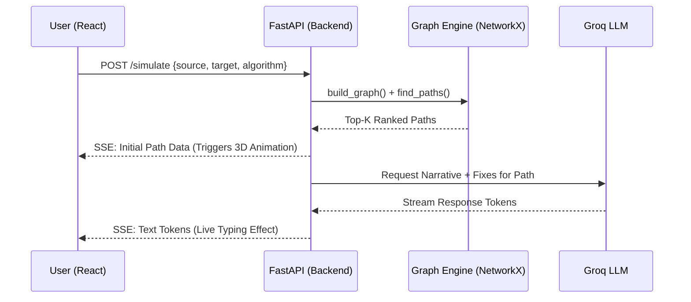

# CyberSentinel: Enterprise Attack Path Simulation Engine
> A full-stack, AI-driven platform for predicting, visualizing, and auto-remediating multi-hop lateral movement attacks in enterprise networks.

---

## 2. Overview
CyberSentinel is a modern cybersecurity tool built for Security Operations Centers (SOCs). It models enterprise networks as mathematical graphs, calculates the "path of least resistance" an attacker would take to reach critical assets, visualizes the attack in an interactive 3D WebGL environment, and streams real-time AI-generated tactical narrations and remediation steps to defenders.

**Who it's for:** CISOs, SOC Analysts, Red Teams, and Blue Teams.
**Problem it solves:** Transforming thousands of disconnected, unreadable vulnerability alerts into a single, cohesive, visual story of a cyberattack.

---

## 3. Why This Project Exists
Traditionally, vulnerability scanners (like Nessus or Qualys) output massive spreadsheets containing thousands of isolated "Critical" CVEs. 
**The Problem:** IT teams cannot easily determine *Lateral Movement*. They don't know which specific sequence of vulnerable servers an attacker will chain together to breach the "Crown Jewels" (e.g., the Bank Vault or Customer Database).
**The Solution:** CyberSentinel mathematically connects the dots. By rendering the network as a directed graph, we allow algorithms to prove exactly how an attacker will move, allowing defenders to patch the most critical structural chokepoint rather than blindly patching random servers.

---

## 4. Key Features
- **3D Network Visualization:** Navigate complex topologies in 3D space to visually trace the exact path an attacker will take.
- **Top-K Attack Path Engine:** Computes the absolute mathematically optimal route (Dijkstra), heuristic routes (A*), and structurally diverse AI-predicted routes (PIGNN).
- **Dynamic Weight Management (DWM):** Automatically penalizes nodes and adjusts risk scores based on live CISA Known Exploited Vulnerability (KEV) data and internet exposure.
- **Generative AI Auto-Fix:** Streams real-time, context-aware firewall ACLs and software patching commands generated by Groq/Llama 3.
- **Offline Parity Engine:** A complete client-side JavaScript port of the Python graph engine allows the frontend dashboard to run attack simulations even when the backend is unreachable.

---

## 5. Tech Stack & Reasoning
### Frontend
- **React 18:** Chosen for its component-based architecture, making it easy to manage complex UI states (side panels, modals, 3D overlays).
- **Vite:** Replaced Create-React-App for significantly faster HMR (Hot Module Replacement) and optimized build times.
- **3d-force-graph (WebGL):** Selected over 2D D3.js because complex enterprise networks (50+ nodes, 100+ edges) become visually cluttered "hairballs" in 2D. 3D physics-based rendering allows natural spacing.

### Backend
- **Python 3 / FastAPI:** Chosen for lightning-fast performance and native async/await support, which is mandatory for Server-Sent Events (SSE) streaming.
- **NetworkX:** The industry standard for complex Graph Theory mathematics; used to calculate Dijkstra and A* paths.
- **PyTorch (PIGNN):** Used to build the Physics-Informed Graph Neural Network, allowing the engine to learn non-linear, structural attack patterns.
- **Groq API (Llama 3.3):** Chosen for its LPU (Language Processing Unit) inference speed. Cybersecurity triage requires instantaneous responses; Groq provides >800 tokens/second streaming.

---

## 6. Project Structure
```text
CyberSentinel/
├── backend/                  # FastAPI server & Graph Engine
│   ├── data/                 # JSON Topologies & NVD datasets
│   ├── pignn/                # PyTorch ML models & inference logic
│   ├── graph.py              # Core NetworkX Dijkstra/A* pathfinding
│   ├── llm.py                # Groq integration & streaming generators
│   ├── main.py               # API routes (/simulate, /fix)
│   └── benchmark.py          # Mathematical optimality testing suite
├── frontend/                 # React UI
│   ├── src/
│   │   ├── components/       # 3D Graph, Panels, Explainer Sandbox
│   │   ├── hooks/            # useSimulation.js (Global state)
│   │   └── data/             # graphEngine.js (Offline Fallback Engine)
│   └── vite.config.js        # Build configuration
└── Readmes/                  # Deep-dive academic documentation
```

### Key Folders Explained
- `backend/data/`: Contains the synthetic topologies (e.g., `enterprise-bank`) calibrated against NIST/SWIFT architectures. Contains both `network.json` (structure) and `cves.json` (vulnerabilities).
- `frontend/src/components/explainer/`: Contains the interactive "Project Guide" which uses visual sandboxes to explain DWM and Graph Theory to non-technical users.

---

## 7. Architecture and Data Flow


*Reasoning inferred:* SSE (Server-Sent Events) was chosen over WebSockets because the data flow is strictly unidirectional (Server -> Client) during simulation streaming, making SSE simpler and less resource-intensive.

---

## 8. Detailed Module Breakdown

### The Graph Engine (`backend/graph.py`)
- **Purpose:** To calculate the exact sequence of hops an attacker will take.
- **How it works:** It converts the JSON nodes into a Directed Graph. It applies a weight to every edge based on the selected Risk Model. It then runs Dijkstra or A* to find the sequence of edges with the lowest total weight.
- **Key Functions:** `build_graph()`, `find_attack_paths()`.

### Dynamic Weight Management (`backend/dwm_scorer.py`)
- **Purpose:** To prevent the engine from treating all CVSS 9.8 vulnerabilities equally.
- **How it works:** It applies mathematical penalties. A base weight of 2.0 might drop to 0.5 (easier for the attacker) if the vulnerability is listed in the CISA KEV catalog or exposed to the internet.
- **Design Decisions:** DWM ensures the simulation mimics real-world hacker behavior, prioritizing known-exploited bugs over theoretical ones.

### The AI Streaming Agent (`backend/llm.py`)
- **Purpose:** To translate mathematical graph paths into human-readable tactical intelligence.
- **How it works:** It uses `yield` generators to stream chunks of text from the Groq API back to the FastAPI router, acting as a real-time cybersecurity sportscaster.

---

## 9. Key Design Decisions

1. **Synthetic Topologies vs. Live Scanning:** 
   - *Choice:* Built synthetic networks calibrated to NIST standards.
   - *Alternative:* Connect directly to a live corporate SIEM/Nessus scanner.
   - *Reasoning:* Strict OPSEC. Real corporate network maps are classified. Synthetic calibration ensures academic rigor without data privacy violations.
2. **Top-K Dijkstra vs. Single Shortest Path:**
   - *Choice:* Using Yen's Algorithm to return the top 5 paths.
   - *Reasoning:* If a Blue Team patches the absolute easiest path, the attacker will just take the 2nd easiest path. Returning Top-K allows defenders to see alternative breach vectors.
3. **SSE (Server-Sent Events) vs WebSockets:**
   - *Choice:* SSE for LLM streaming.
   - *Reasoning:* WebSockets require keeping stateful two-way connections open, which is overkill for unidirectional text streaming.

---

## 10. Setup and Installation

**Prerequisites:** Python 3.10+, Node.js 18+.

**1. Clone and setup Backend:**
```bash
git clone https://github.com/yourusername/CyberSentinel.git
cd CyberSentinel/backend
python -m venv venv
source venv/Scripts/activate  # Windows: venv\Scripts\activate
pip install -r requirements.txt
```

**2. Setup Frontend:**
```bash
cd ../frontend
npm install
```

**3. Environment Variables:**
Rename `.env.example` to `.env` in the `backend` folder and add your Groq API key:
```ini
GROQ_API_KEY=gsk_your_api_key_here
```

---

## 11. Usage

**Start the Backend:**
```bash
cd backend
python main.py
# Server runs on http://localhost:8000
```

**Start the Frontend:**
```bash
cd frontend
npm run dev
# Dashboard runs on http://localhost:5173
```
*Example Usage:* Open `http://localhost:5173`. Select **Enterprise Bank** from the header. Choose **Public API Gateway** as the entry point and **SWIFT Terminal** as the target. Click **Simulate Attack**. The 3D graph will zoom into the network and trace the red path, while the side panel streams the AI narrative.

---

## 12. Configuration
- `backend/.env`: `GROQ_API_KEY` (Required for AI generation).
- `frontend/.env`: `VITE_API_BASE_URL` (Optional, defaults to `http://localhost:8000`).

---

## 13. Testing
To mathematically verify that the pathfinding algorithms are working correctly, we built an exhaustive brute-force enumeration script.
```bash
cd backend
python benchmark.py
```
This script enumerates every possible permutation in the network and asserts that Dijkstra's output matches the absolute mathematical ground truth. It also generates the 3x3 algorithm/risk-model evaluation matrix.

---

## 14. Challenges and Solutions

**Challenge: The "Cloned Node" Problem**
In a load-balanced environment, there might be 5 identical web servers. Traditional algorithms like Dijkstra will return 5 alternative paths that simply swap `Web_Server_1` for `Web_Server_2`. This is mathematically optimal but useless to a defender, as it represents the exact same attack vector.
**Solution:** We implemented a **Structural Diversity Filter (Jaccard Distance)** inside the PIGNN model. It forces alternative paths to have less than 85% similarity to the main path, ensuring the engine discovers truly distinct breach vectors (e.g., pivoting through an IoT camera instead of another web server).

---

## 15. Known Limitations and Future Improvements
- **Limitation:** The current system relies on pre-compiled JSON topologies.
- **Future Improvement:** Develop a connector to ingest live vulnerability data directly from Tenable/Nessus APIs or AWS Security Hub to generate the 3D graph dynamically for a live corporate environment.
- **Limitation:** PIGNN inference is currently simulated on CPU, which can be slow for graphs exceeding 10,000 nodes.
- **Future Improvement:** Implement GPU acceleration via CUDA in PyTorch for the `pignn/inference.py` module.

---

## 16. Contributing and License
Contributions to the pathfinding logic (`backend/graph.py`) or new 3D visualizations (`frontend/src/components/`) are welcome via Pull Requests. Ensure all graph algorithms pass the `benchmark.py` optimality test before merging.
License: MIT.
